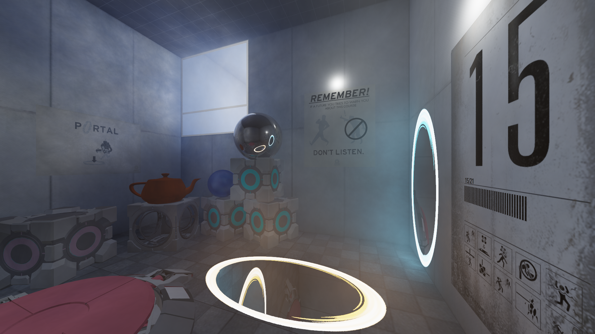
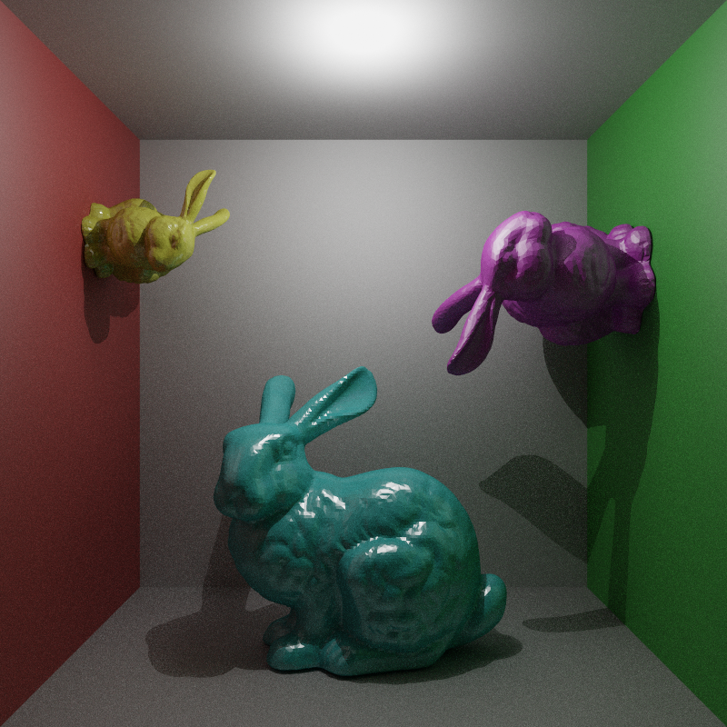
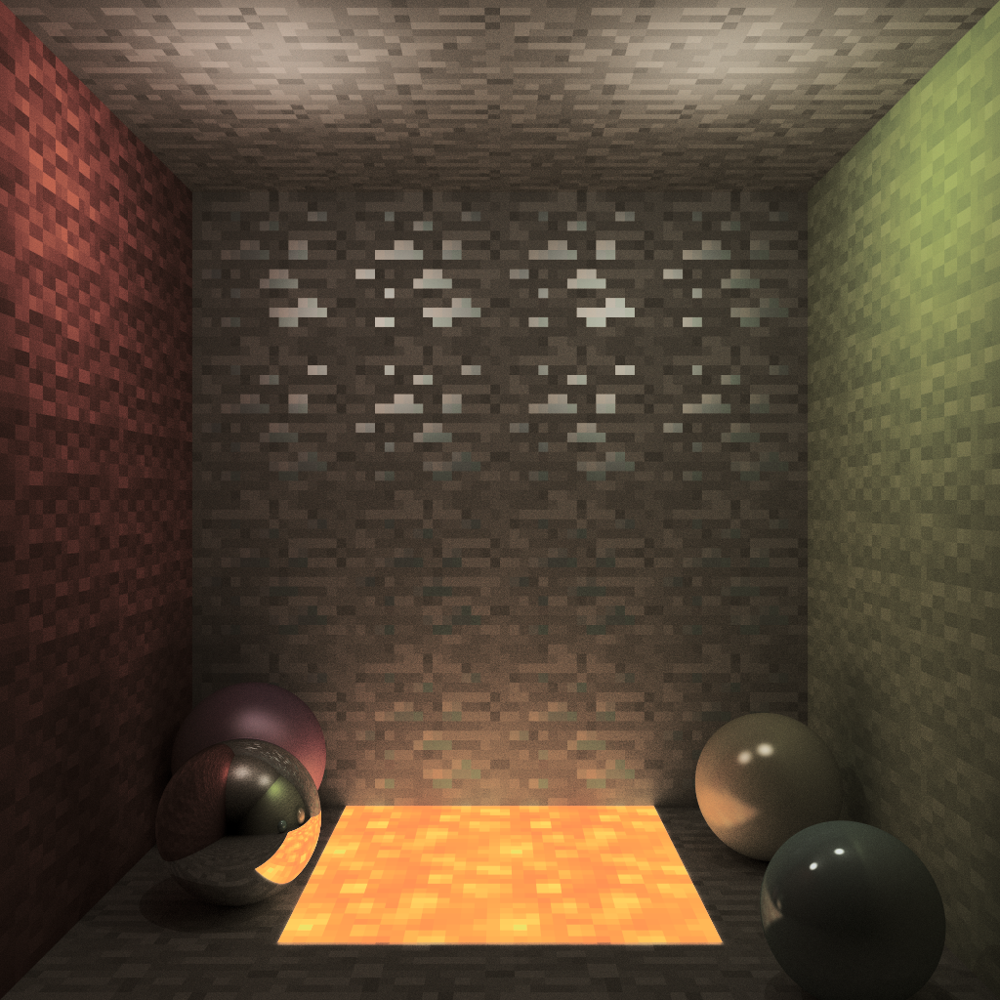
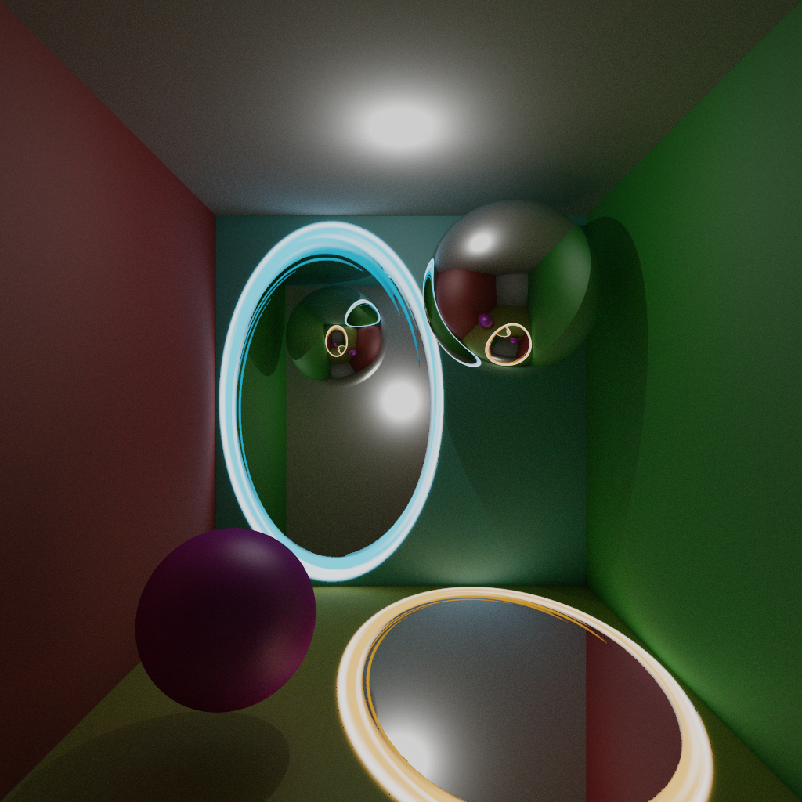
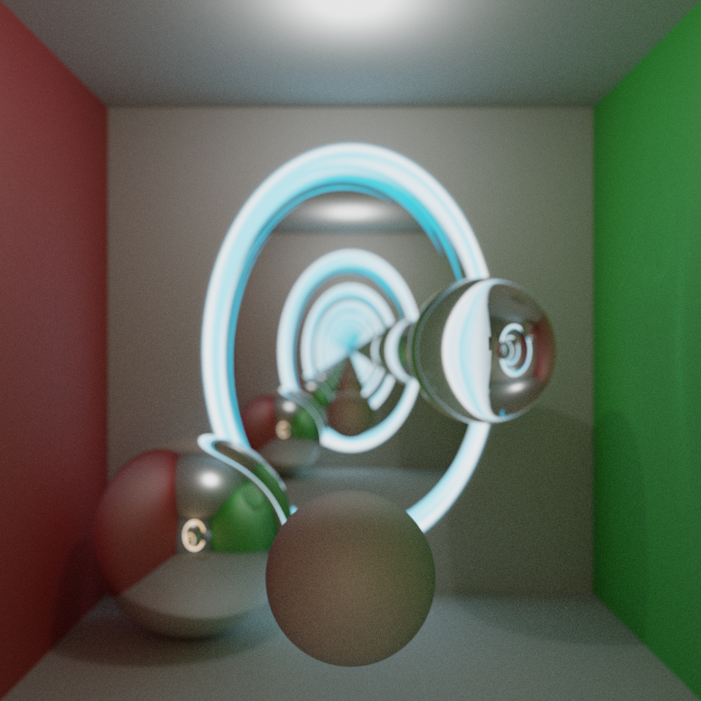
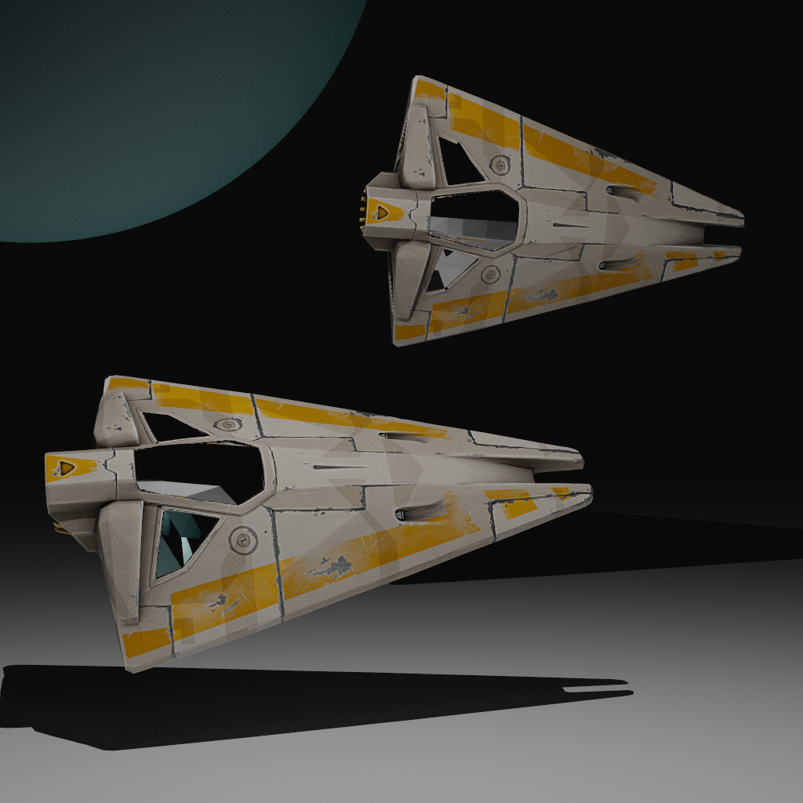

  <h1 align="center">Computer graphics</h1>

  

    Repository for all assignments of the Computer Graphics course
     
    taught at University of Zaragoza (2019-20)
     
    <i>
    <a href="https://github.com/diegoroyo/igrafica/tree/master/pathtracer">Path tracer</a>
    ·
    <a href="https://github.com/diegoroyo/igrafica/tree/master/photonmapper">Photon mapper</a>
    ·
    <a href="https://github.com/diegoroyo/igrafica/tree/master/tonemapper">Tone mapper</a>
    </i>
  

_Models and textures obtained from Portal 2's game files, and also [here](https://www.models-resource.com/pc_computer/portal2/) and [there](https://www.thinking.withportals.com/view-download/?id=514). That teapot is the famous [Utah teapot](https://en.wikipedia.org/wiki/Utah_teapot)! All credit goes to their respective owners._

## Project structure

This repository contains three main projects, all developed in pure C++ without the use of any external libraries:

* [Path tracer](https://github.com/diegoroyo/igrafica/tree/master/pathtracer)
* [Photon mapper](https://github.com/diegoroyo/igrafica/tree/master/photonmapper)
* [Tone mapper](https://github.com/diegoroyo/igrafica/tree/master/tonemapper)

## Examples

Here are some renders generated and tonemapped by the given code:

Stanford bunnies | Minecraft textures
:---: | :---:
 | 

Thinking with portals | Depth of field
:---: | :---:
 | 

Space | Depth of field
:---: | :---:
 | 

## Creators

* Diego Royo _(740388@unizar.es)_
